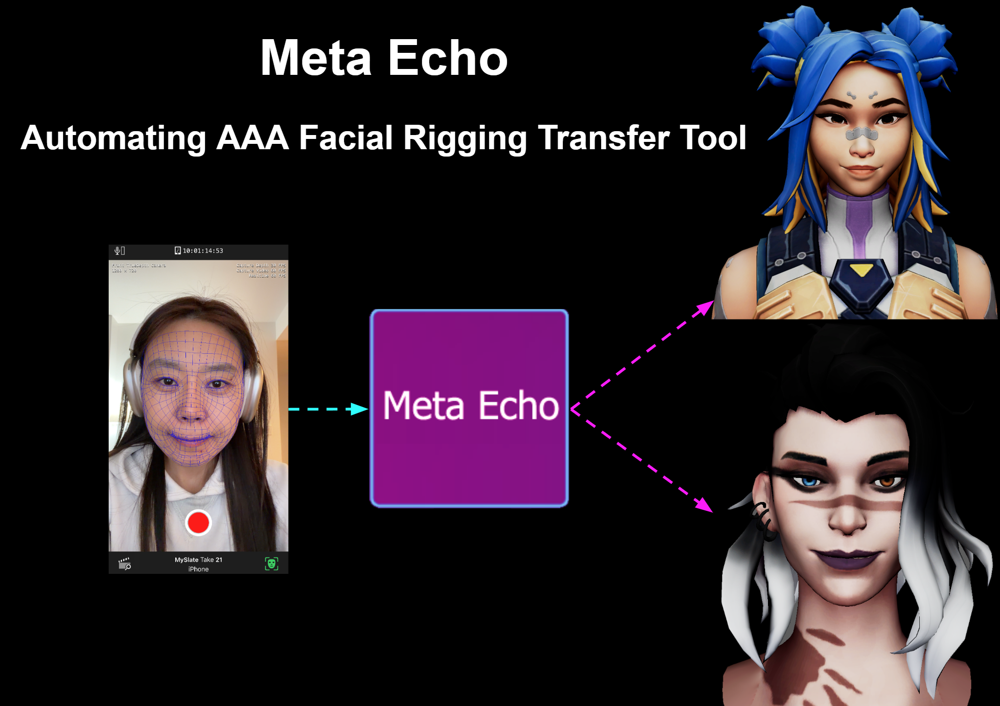
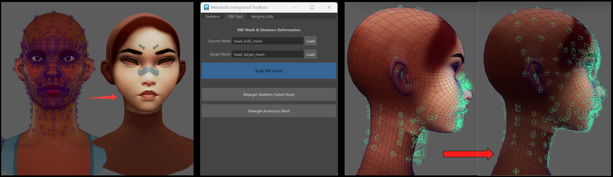

# MetaEcho

**Automate facial rigging from MetaHuman to any custom character — no rigging or animation skills required.**



## Problem

MetaHuman delivers incredible facial performance via Live Link. But most developers can't key facial animation manually — it's too difficult and time-consuming.

## Solution

MetaEcho connects your cartoon/custom characters to MetaHuman rigs instantly. It empowers every developer to create high-quality facial animations without any rigging or animation expertise.

<!-- ## Demo

https://github.com/user-attachments/assets/dd720a30-599c-4971-aded-82a16522abc1


https://github.com/user-attachments/assets/demo01.mp4 -->

<!-- <video src="images/demo01.mp4" controls width="100%"></video> -->

## How It Works

The core engine is based on **Radial Basis Function (RBF)** interpolation, inspired by the classic SIGGRAPH 2000 paper *"Pose Space Deformation"*. Unlike simple linear rigging, RBF allows for non-linear deformation — critical because facial expressions are complex, curved movements, not straight lines.

The RBF solver acts as a **mathematical bridge** between two different mesh topologies.


## Workflow

1. **Load Source & Target** — Load the original MetaHuman head as Source and your cartoon face as Target.
2. **Build Solver** — Click `Build Solver` to generate a Mapping Matrix that bridges the two meshes.
3. **Retarget Skeleton** — Select the Source skeleton and Target, then click `Retarget` to generate new joints that fit your character.
4. **Bind & Copy Skin Weights** — Bind the target mesh to the new joints, then use `Copy Skin Weights` to transfer professional weight data from source to target.
5. **Joint Constraint** — Run the `Joint Constraint` logic to connect MetaHuman animation data directly to your new skeleton.
6. **Done!** — Use the GUI panel or Live Link Control Rig data to drive your cartoon character with smooth, perfectly synced performance.

## Requirements

- Autodesk Maya (with Python support)
- `numpy`, `scipy`
- MetaHuman source project

## Usage

Run in Maya's Script Editor:

```python
import metaEcho_RunTool
tool = metaEcho_RunTool.MetaEchoFullToolbox()
tool.show()
```

## License

© MetaEcho Team. All rights reserved.
